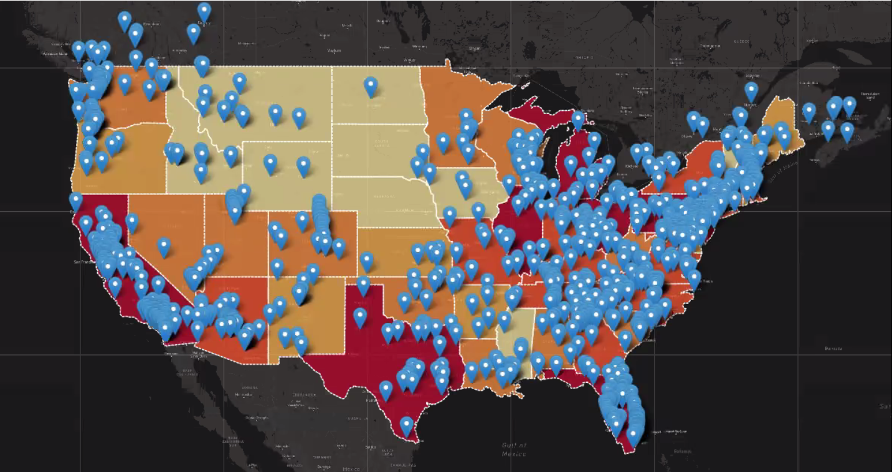
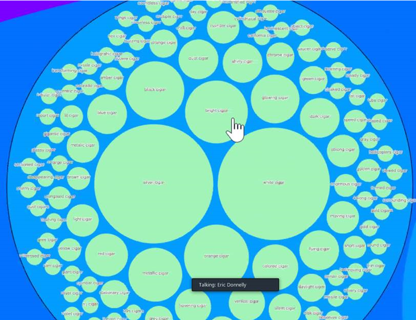
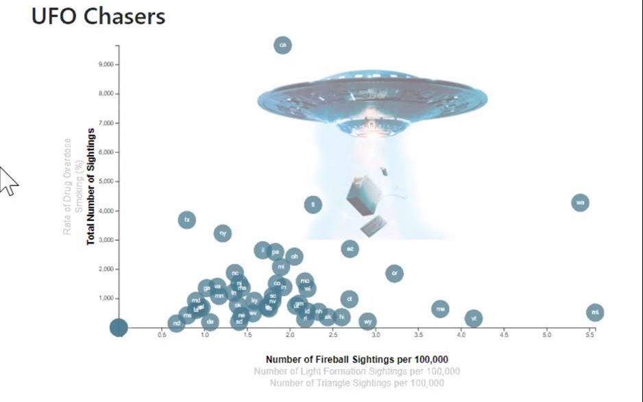
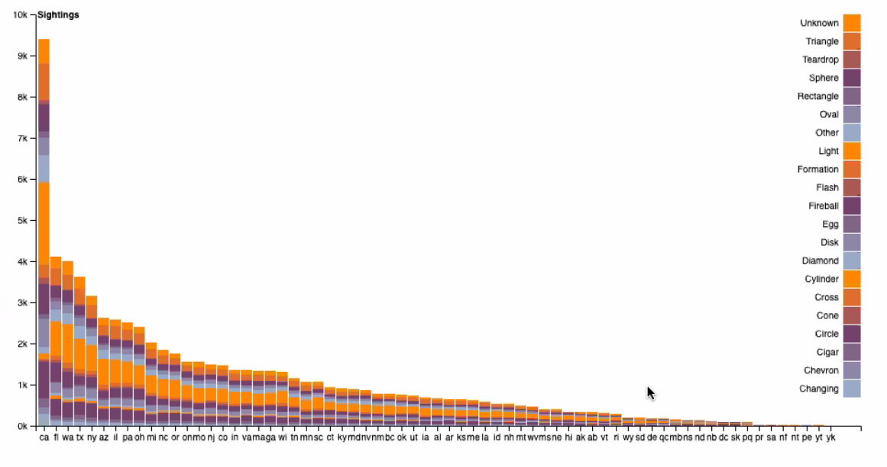

## Worldwide-UFO-Sightings

## Overview
This website displays information about UFO sightings occuring between the years 1906 and 2014. Information on each sighting includes the time and date, location, shape, duration, and geographic coordinates.

## Website Design

### Backend
The website runs on a Python Flask app. With the exception of the circle-packing visualization and the bar chart, data for visualizations are served through the Flask app from several tables in a SQLite database. The SQLite database was created from CSV files gathered from several sources.

                # creating a SQL Alchemy ORM
                engine = create_engine("sqlite:///database/database.sqlite")
                Base = automap_base()
                Base.prepare(engine, reflect=True)

                # table names
                ufo_data = Base.classes.ufo_data
                state_stats = Base.classes.state_stats
                merge_again = Base.classes.merge_again
                shape_counts = Base.classes.shape_counts

                app = Flask(__name__)

                ########D3 Visualization###########

                @app.route("/d3")
                def d3():
                return render_template('d3.html')

                @app.route("/d3data")
                def d3data():

                session = Session(engine)

                from flask import jsonify

                results = session.query(\
                merge_again.death_rate,\
                merge_again.population,\
                merge_again.state_sightings,\
                merge_again.smokes,\
                merge_again.fireball,\
                merge_again.light,\
                merge_again.triangle,\
                merge_again.state_abb).all()

                session.close()

                big_list = []

                for result in results:

                    obj = {
                        'death_rate': result[0],
                        'population': result[1],
                        'state_sightings': result[2],
                        'smokes': result[3],
                        'fireball': result[4],
                        'light': result[5],
                        'triangle': result[6],
                        'state_abb': result[7]
                    }
                    
                    big_list.append(obj)

                data=jsonify(big_list)

                return data

### Frontend
Data from the API calls to the SQL database made by the Flask APP are then sent to JavaScript files. Together, Javascript, HTML, and CSS were used to produce the visualizations, which were created using Leaflet and D3 libraries.

                // Retrieve data from the SQL database and execute everything below
                d3.json("http://127.0.0.1:5000/d3data").then(function(ufoData, err) {
                if (err) throw err;

                // parse data
                ufoData.forEach(function(data) {
                    data.death_rate = +data.death_rate;
                    data.population = +data.population;
                    // divide population by 100,000
                    data.state_sightings = +data.state_sightings;
                    data.smokes = +data.smokes;
                    // grab initial value for number of fireball sightings by state
                    data.fireball_adj = +data.fireball; 
                    // divide fireball sightings by number of residents per 100,000
                    data.fireball = +data.fireball_adj * 100000 / data.population;
                    data.light_adj = +data.light;
                    data.light = +data.light_adj * 100000 / data.population;
                    data.triangle_adj = +data.light;
                    data.triangle = +data.triangle_adj * 100000 / data.population;
                });

                // xLinearScale function above csv import
                var xLinearScale = xScale(ufoData, chosenXAxis);
                var yLinearScale = yScale(ufoData, chosenYAxis);

## Visualizations

A heatmap was created using JS Leaflet to display the locations of sightings throughout North America.

### Heatmap of Sighting Locations

### Map of UFO Sightings and Drug Deaths

It was hypothesized that areas with heavier drug users would have more sightings. The Leaflet map below illustrates the relationship between the number of deaths from illicit substances reported for each state and the number of reported sightings in January and February of 2014.

### Visualization of Word Assocations and UFO Shapes

Using R and D3, a visualization was created from comments from individuals reporting sightings. This interactive circle-packing map shows the associations between particular phrases and types of shapes reported. For example, individuals who reported seeing UFO shapes resembling fireballs were more likely to use descriptive words associated with light and heat such as *glowing*, *pulsating*, *orange*, etc.

### Scatterplot of UFO Shapes and Drug Use

Other visualizations included a scatterplot illustrating the relationships between UFO shapes and drug use, and a barchart showing sighting shape frequencies by state. Both visualizations were created using JS D3.

### Barchart of Sighting Shape Frequencies by State

