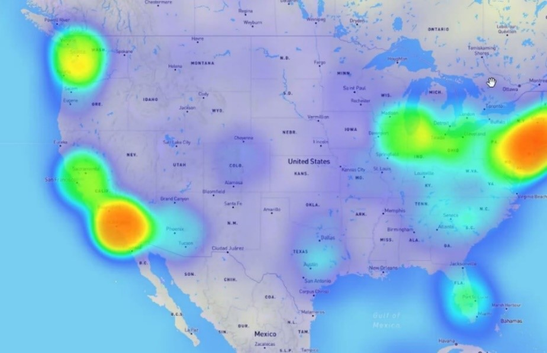

## Worldwide-UFO-Sightings

## Overview
This website displays information about UFO sightings occuring between the years 1906 and 2014. Information on each sighting includes the time and date, location, shape, duration, and geographic coordinates. A heatmap displays the locations of sightings throughout North America.

### Heat Map of Sighting Locations

### Map of UFO Sightings and Drug Deaths

It was hypothesized that areas with heavier drug users would have more sightings. A map illustrates the relationship between the number of deaths from illicit substances reported for each state in 2018 and the number of reported sightings in January and February of 2014.

### Visualization of Word Assocations and UFO Shape

Analysis was done on comments from individuals reporting sightings. An interactive circle-packing map shows the associations between particular phrases and types of shapes reported. For example, individuals who reported seeing UFO shapes that resembled fireballs were more likely to use descriptive words associated with light and heat such as *glowing*, *pulsating*, *orange*, etc.

### Scatterplot of UFO Shapes and Drug Use

Other visualizations included a scatterplot illustrating the relationships between UFO shapes and drug use, and a barchart showing the sighting shape frequencies by state.

### Barchart of Sighting Shape Frequencies by State

